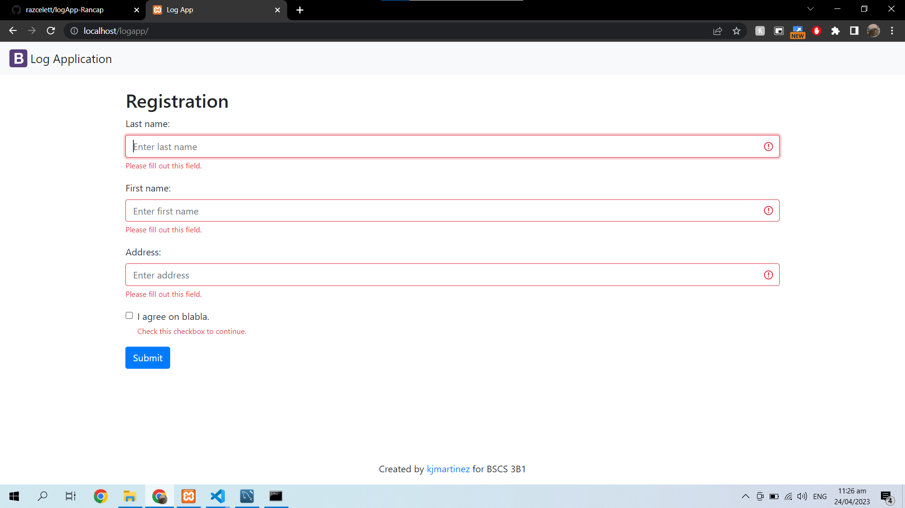
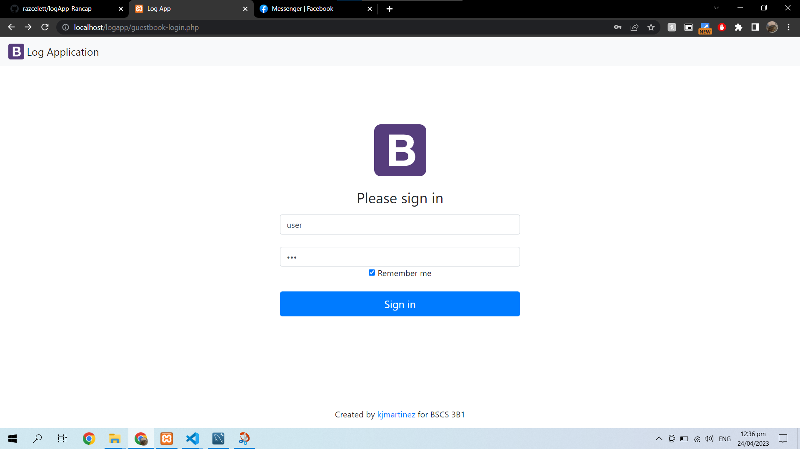
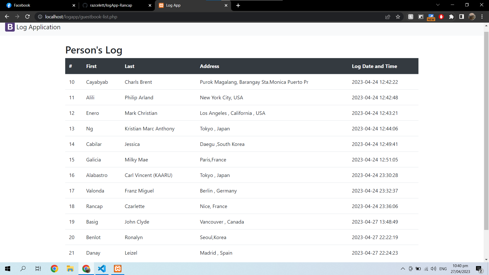
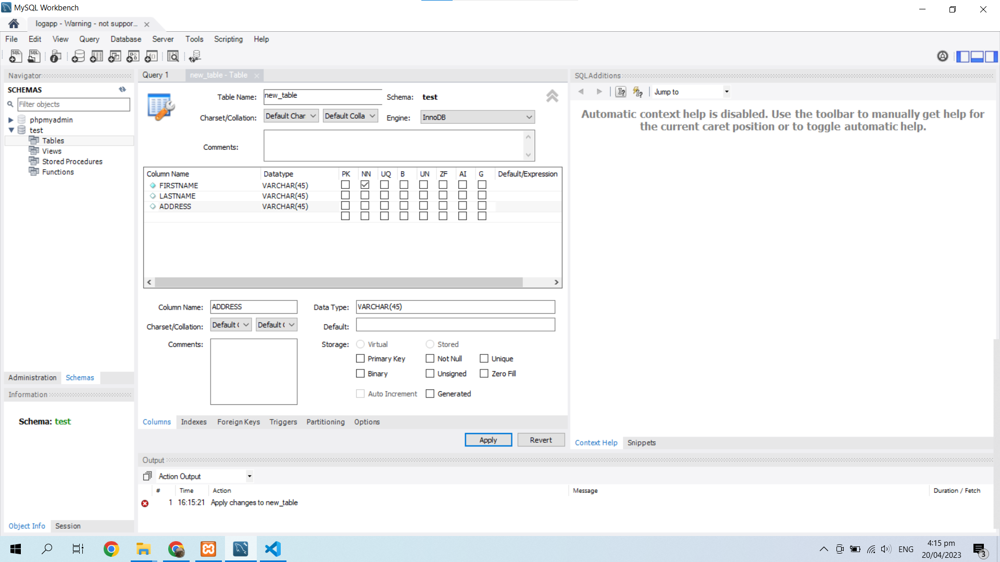
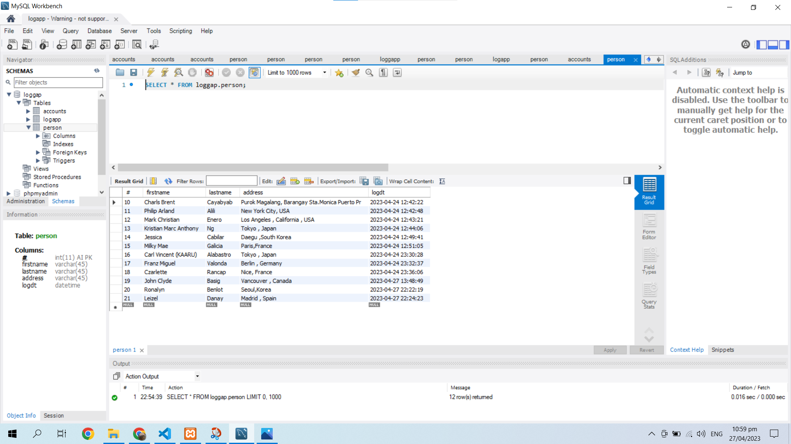

# LOG APPLICATION

Logging Aplication is contains information about events that have occurred within a software application. These events are logged out by the application and written.

# ABOUT LOG APPLICATION

Log Application is is a file that contains information about events that have occurred within a software These events are logged out by the application and written to the file. They can include errors and warnings as well as informational events.

The Admin will have an access to the *Person Log* tab and this tab will show the list of individual's who fill out the form. This includes their name, address and logged date and time.

 
 
 

To protect an individual's personal information (RA 10173, Data Privacy Act of 2012), only users with an admin account can view the list of individuals who visited the premises.

# Installation of My SQL 
If you want to see more CRUD visit tis link for tutorials : https://www.youtube.com/watch?v=p1lbbaGT9HI&t=2s&ab_channel=JaypsLazaro

Databases are the essential data repository for all software applications. 

For example, whenever someone conducts a web search, logs in to an account, or completes a transaction, a database system is storing the information so it can be accessed in the future.

# MySQL Advantages and Disadvantages
*ADVANTAGE*

* Reduced Total Cost of Ownership

* Portability

* Seamless Connectivity

* Rapid Development and Round-the-Clock Uptime

* Data Security

*DISADVANTAGE*

* MySQL lower version (5.0 or less) doesn't support ROLE, COMMIT and stored procedure.

* MySQL does not support a very large database size as efficiently.

* MySQL doesn't handle transactions very efficiently and it is prone to data corruption.

# AUTHOR

**Charls Brent C. Cayabyab** a student of Palawan State University and currently taking Bachelor of Science in Computer Science, is the author of the logApp-Cayabyab Github repository.

**Github Account** : https://github.com/CharlsCayabyab27

**Github Repository** : https://github.com/CharlsCayabyab27/logAppscaleOcto-Cayabyab

**Email** :202080463@psu.palawan.edu.ph

**Facebook** : https://www.facebook.com/CharlsCayabyab27
